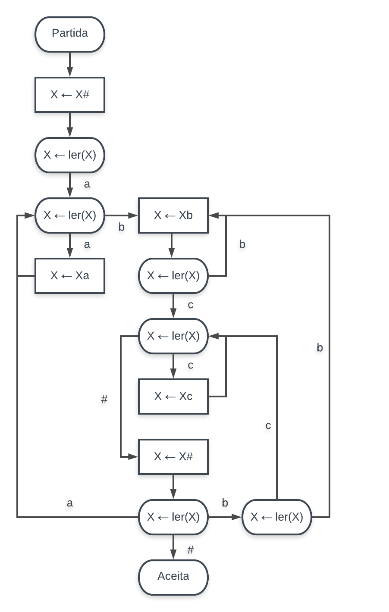

# Simulador de Máquina de Post
Simulador de [Máquinas de Post](http://www.iasi.cnr.it/~adp/ErrataCorrige/errataCorrigeCDCSection9.1.pdf) desenvolvido para a disciplina de Teoria da Computação (TEC).
#### Instruções de Execução
Clonar este repositório:

    git clone https://github.com/luizaes/post-machine-simulator.git pm-simulator

Acessar a pasta referente ao simulador:

    cd pm-simulator

Executar o Makefile:

    make

Executar o programa, passando como entrada o arquivo descrevendo a máquina de Post:

    ./post-machine < `pm_example1.txt`

#### Instruções para Formatação do Arquivo de Entrada

* Na primeira linha, deve ser informada a quantidade de estados que a máquina de Post possui, ou seja, o número de classes que representam o diagrama de fluxos;
* Em sequência, uma lista especificando o nome de cada um dos estados deve ser apresentada. É obrigatório que cada estado possua um identificador único, e que, no caso de ser um estado do tipo desvio, tenha um identificador que inicie com a palavra-chave READ, ou se for do tipo atribuição, inicie com a palavra ADD;
* Na terceira linha, temos o nome do estado de partida;
* Na quarta, temos o nome do estado de aceitação;
* Em seguida, temos um número n que representa a quantidade de transições ou ligações existentes no diagrama de fluxos;
* Nas n linhas seguintes, devem ser especificadas cada uma das ligações, de modo que após um estado ADD, seja escrito o símbolo que queremos adicionar à fila; e após um estado READ, seja apresentado um símbolo ao qual quando lido da fila, leve ao estado definido na sequência;
* Por último, na linha final do arquivo especificamos qual palavra de entrada queremos testar no simulador.

Para melhor compreensão, o arquivo `pm_example1.txt` representa o seguinte diagrama de fluxos:

